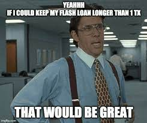

# Flash Loans




Flash Loans allow you to borrow any available amount of assets without putting up any collateral, as long as the liquidity is returned to the protocol within one block transaction.


* Flash swaps farms contracts can lend out up to the entire rewards token balance in flash loan operations.
* 0.05% fees. (Generates yield for the capital deposited into farms)

```
interface IFlashBorrower {
    /// @notice The flashloan callback. `amount` + `fee` needs to repayed to msg.sender before this call returns.
    /// @param sender The address of the invoker of this flashloan.
    /// @param token The address of the token that is loaned.
    /// @param amount of the `token` that is loaned.
    /// @param fee The fee that needs to be paid on top for this loan. Needs to be the same as `token`.
    /// @param data Additional data that was passed to the flashloan function.
    function onFlashLoan(
        address sender,
        address token,
        uint256 amount,
        uint256 fee,
        bytes calldata data
    ) external;
}
```
