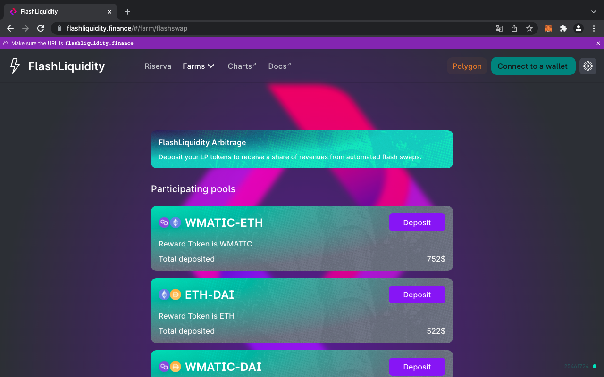
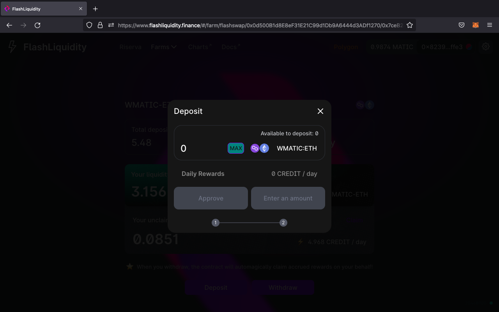

# Farming Quickstart

### Staking LP tokens

[FlashLiquidity farming options](../ecosystem/farms/)

After providing liquidity in one of the Flashliquidity pools presents in the Farm section of FlashLiquidity Dapp you should now possess LP tokens proportional to the amounts of the tokens deposited in the pool.

You can now stake these LP tokens in the corresponding contract of the Flashliquidity Farms sections ([Flash Swaps](../ecosystem/farms/flash-swaps-farms.md) or [FLIQ mining](../ecosystem/farms/fliq-farms.md)) using the deposit button and start earning a share of the automated Flash Swaps profit and/or FLIQ tokens.


Flash swaps are performed when a certain level of dynamic profit (minimum profit) is obtained and then 98% of the profit is distributed to liquidity providers staking their token in the Farm section while 2% is kept by the protocol for further expansion, infrastructure maintenance, contests reward and much more.

